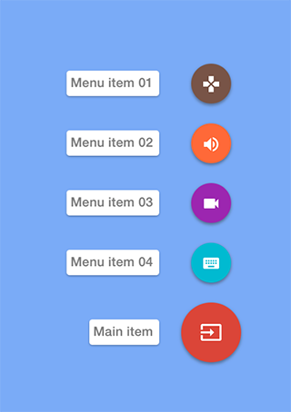

# FloatingActionMenu

iOS FloatingActionMenu like inbox from google.



####Usage

Very simple to use.

```objective-c
NSArray* items = @[ @{ FloatingActionMenuImage : [UIImage imageNamed:@"Item01"],
                           FloatingActionMenuText : @"Menu item 01",
                           FloatingActionMenuColor : [UIColor colorWithRed:0.47 green:0.33 blue:0.28 alpha:1] },
                        @{ FloatingActionMenuImage : [UIImage imageNamed:@"Item02"],
                           FloatingActionMenuText : @"Menu item 02",
                           FloatingActionMenuColor : [UIColor colorWithRed:1 green:0.41 blue:0.22 alpha:1] },
                        @{ FloatingActionMenuImage : [UIImage imageNamed:@"Item03"],
                           FloatingActionMenuText : @"Menu item 03",
                           FloatingActionMenuColor : [UIColor colorWithRed:0.61 green:0.15 blue:0.69 alpha:1] },
                        @{ FloatingActionMenuImage : [UIImage imageNamed:@"Item04"],
                           FloatingActionMenuText : @"Menu item 04",
                           FloatingActionMenuColor : [UIColor colorWithRed:0 green:0.73 blue:0.82 alpha:1] } ];
FloatingActionMenu* actionMenu = [FloatingActionMenu createMenu:self
                                                              image:[UIImage imageNamed:@"Main"]
                                                      expandedImage:[UIImage imageNamed:@"MainExpanded"]
                                                          titleText:@"Main item"
                                                              color:[UIColor colorWithRed:0.86 green:0.27 blue:0.22 alpha:1]
                                                      expandedItems:items];
```
